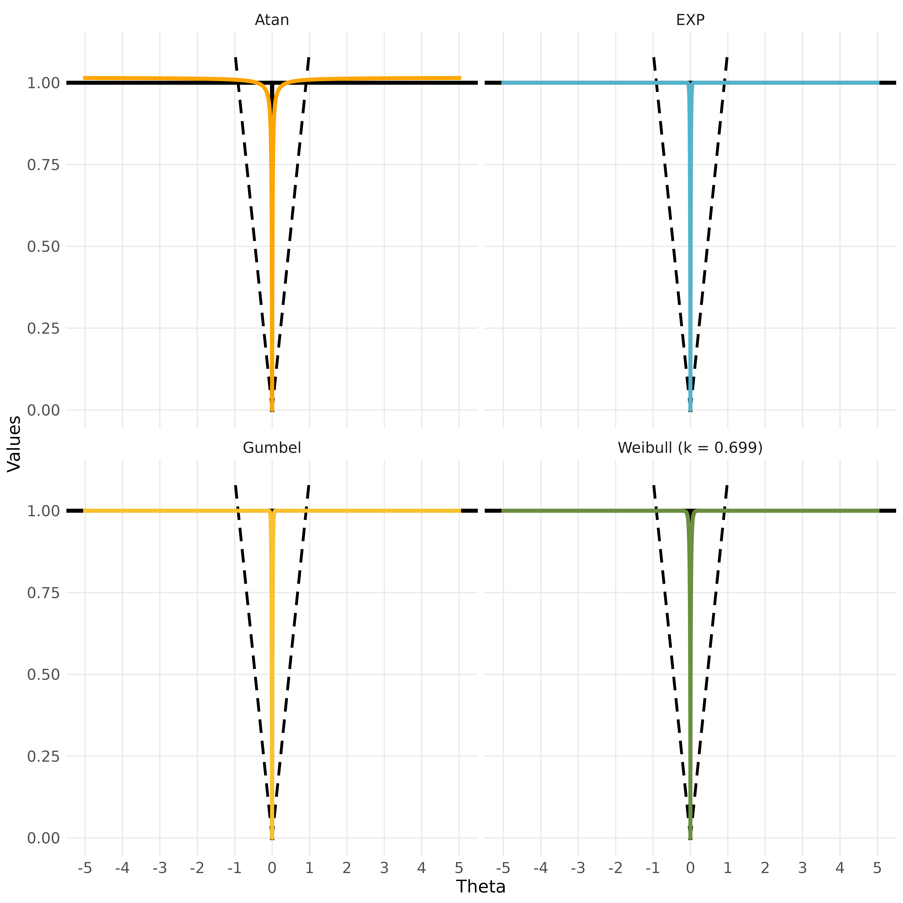

<table style="border: none; border-collapse: collapse;">
<tr style="border: none;">
<td style="border: none; vertical-align: middle; padding-right: 24px;">

</td>
<td style="border: none; vertical-align: middle;">

# L0ggm
L0 Norm Regularization Penalties for Gaussian Graphical Models

<!--- CRAN
<a href="https://CRAN.R-project.org/package=L0ggm"></a>
--->

<!--- GitHub release
<a href="https://github.com/AlexChristensen/L0ggm/releases"></a>
--->

<!--- GitHub workflow --->
<a href="https://github.com/AlexChristensen/L0ggm/actions/workflows/r.yml"></a><br/>

<!--- GitHub status --->
<!--- Active
<a href="https://www.repostatus.org/#active"></a>
--->

<!--- Work in Progress --->
<a href="https://www.repostatus.org/#wip"></a>

<!--- Total downloads
<a href="https://r-ega.net"></a>
--->

</td>
</tr>
</table>

---

## Overview

This package estimates **Gaussian graphical models** (GGMs) using regularization penalties that approximate the $L_0$ norm. In a GGM, the nonzero off-diagonal entries of the precision matrix (inverse covariance) encode conditional dependence relationships between variables — the network structure. Recovering this sparse structure from data is the central estimation challenge.

The package implements four continuous, differentiable approximations to the $L_0$ norm as regularization penalties, applied through a Local Linear Approximation (LLA) framework that wraps the graphical LASSO solver. The **adaptive Weibull** penalty is the default, and is the primary methodological contribution of the package.

---

## Why $L_0$ Regularization?

### The role of regularization in network estimation

Estimating a GGM requires finding a sparse precision matrix $\mathbf{K}$ that balances fit to the data against model complexity:

$$\underset{\mathbf{K} \succ 0}{\text{minimize}} \quad -\log \det \mathbf{K} + \text{tr}(\mathbf{S}\mathbf{K}) + \sum_{i \neq j} \rho(K_{ij})$$

where $\mathbf{S}$ is the empirical covariance matrix and $\rho(\cdot)$ is a penalty function. The choice of $\rho$ determines both the computational tractability of the problem and the statistical properties of the solution.

### $L_1$ regularization (GLASSO)

The graphical LASSO (GLASSO; Friedman, Hastie, & Tibshirani, 2008) uses an $L_1$ penalty, $\rho(x) = \lambda |x|$, which makes the problem strictly convex and globally solvable via coordinate descent. These properties have made GLASSO the dominant approach in network estimation and it remains a valuable, well-understood tool.

However, $L_1$ regularization carries an inherent statistical cost. Because the $L_1$ penalty grows linearly and without bound, it must shrink every coefficient toward zero to impose sparsity. This creates a tension: the same $\lambda$ that zeros out small spurious edges also attenuates the magnitude of large true edges. As a result, GLASSO tends to produce **biased estimates** of nonzero partial correlations, and achieving consistent edge selection often requires a $\lambda$ large enough to meaningfully distort edge magnitudes. In settings where the true network is very sparse or where variables have heterogeneous effect sizes, this bias can be consequential.

### $L_0$ regularization

The $L_0$ norm counts the number of nonzero elements, $\|x\|_0 = |\{i : x_i \neq 0\}|$, and the $L_0$ penalty applies a fixed cost $\lambda$ to each nonzero edge regardless of its magnitude:

$$\rho_0(x) = \lambda \cdot \mathbf{1}(x \neq 0)$$

Unlike $L_1$, the $L_0$ penalty imposes **no shrinkage on nonzero coefficients** — it distinguishes only between zero and nonzero. Under standard regularity conditions, $L_0$-penalized estimators satisfy the **oracle property** (Fan & Li, 2001): asymptotically, they identify the true edge set exactly and estimate nonzero edges as if the true support were known in advance. This means better sparsity recovery, less bias in edge magnitudes, and more reliable structure learning — particularly in high-dimensional settings where $p$ is large relative to $n$.

---

## From $L_0$ to Tractable Approximations

Direct $L_0$ minimization requires searching over all $2^{p(p-1)/2}$ subsets of candidate edges. For even modest network sizes (e.g., $p = 20$ implies 190 candidate edges), this combinatorial search is computationally intractable.

{L0ggm} addresses this through **continuous smooth approximations** $\rho(x;\, \lambda, \gamma)$ that closely mimic the $L_0$ indicator and satisfy three key properties:

1. $\rho(0;\, \lambda, \gamma) = 0$ — zero penalty at zero
2. $\rho(x;\, \lambda, \gamma) \to \lambda$ as $|x| \to \infty$ — bounded, like $L_0$
3. $\rho(x;\, \lambda, \gamma) \to \lambda \cdot \mathbf{1}(x \neq 0)$ as $\gamma \to 0$ — converges to the $L_0$ step function

Because the approximations are differentiable, their derivatives can be used as adaptive, element-wise GLASSO penalty weights via the **Local Linear Approximation** (LLA; Fan & Li, 2001; Zou & Li, 2008). At iteration $t$, the penalty is linearized around the current estimate $\mathbf{K}^{(t)}$:

$$\rho(K_{ij}) \approx \rho(K_{ij}^{(t)}) + \rho'(K_{ij}^{(t)}) \cdot (K_{ij} - K_{ij}^{(t)})$$

which reduces each step to a re-weighted GLASSO problem. A single LLA pass (the default) is extremely fast and produces estimates with strong theoretical guarantees (Zou & Li, 2008). Full iterative LLA to convergence is also available via `LLA = TRUE`.

The four penalties available in {L0ggm} are:

| Penalty | Formula |
|---------|---------|
| `"atan"` (Wang & Zhu, 2016) | $\lambda \left(\gamma + \dfrac{2}{\pi}\right) \arctan \left(\dfrac{\lvert x \rvert}{\gamma}\right)$ |
| `"exp"` (Wang, Fan, & Zhu, 2018) | $\lambda \left(1 - e^{-\lvert x \rvert / \gamma}\right)$ |
| `"gumbel"` | $\lambda \left(e^{-e^{-\lvert x \rvert / \gamma}}\right)$ |
| `"weibull"` *(default)* | $\lambda \left(1 - e^{-\left(\lvert x \rvert / \gamma\right)^k}\right)$ |

<em><strong>Note.</strong> Gumbel adjusts $\lambda = \dfrac{\lambda}{1 - e^{-1}}$ to scale consistently with other penalties and subtracts $e^{-1}$ from the penalty (prior to lambda) to adjust the y-intercept to zero.</em>

<p align="center">

</p>
<br>
<em><strong>Figure 1.</strong> $L_0$ norm approximation penalties as a function of coefficient magnitude. Solid line: $L_0$ norm (step function). Dashed lines: $L_1$ norm (LASSO) and each continuous approximation penalty implemented in {L0ggm}.</em>

---

## The Weibull Penalty

### What makes it different

The Weibull penalty introduces a **shape parameter** $k > 0$ that continuously interpolates between qualitatively different penalty regimes:

- **$k = 1$**: reduces exactly to the EXP penalty
- **$k < 1$**: the penalty becomes more concave than exponential, with a steeper rise near the origin and faster convergence to $\lambda$ — more closely approximating the $L_0$ step function
- **$k \to 0$**: approaches the $L_0$ indicator $\lambda \cdot \mathbf{1}(x \neq 0)$

This means $k$ directly controls the **degree of sparsity bias**: smaller $k$ imposes less shrinkage on nonzero coefficients and more aggressively zeros small ones. Rather than fixing $k$ by hand, {L0ggm} estimates it from the data.

### Adaptive parameter estimation

When `adaptive = TRUE` (the default), both the shape $k$ and scale $\gamma$ of the Weibull penalty are calibrated to the observed partial correlation distribution, making the penalty data-driven rather than fixed.

**Step 1 — Fit Weibull to empirical partial correlations.** Let $\{|p_{ij}|\}$ denote the lower-triangular absolute partial correlations. Maximum likelihood estimates $\hat{k}$ and $\hat{\lambda}_W$ are obtained by solving:

$$\frac{\sum_i |p_i|^{\hat{k}} \log|p_i|}{\sum_i |p_i|^{\hat{k}}} - \frac{1}{\hat{k}} - \frac{1}{n}\sum_i \log|p_i| = 0$$

$$\hat{\lambda}_W = \left(\frac{1}{n}\sum_i |p_i|^{\hat{k}}\right)^{1/\hat{k}}$$

**Step 2 — Cap shape.** To guarantee that the penalty is at least as concave as EXP (a necessary condition for the $L_0$ approximation quality), the shape is capped:

$$k = \min\left(\hat{k},\, 1\right)$$

If $k$ is capped at 1, $\hat{\lambda}_W$ is replaced by the sample mean of $|p_{ij}|$.

**Step 3 — Set adaptive scale.** The scale parameter $\gamma$ is set to the standard deviation of the fitted Weibull distribution, normalized by $\sqrt{n}$:

$$\gamma = \frac{\hat{\lambda}_W \sqrt{\Gamma\left(1 + \tfrac{2}{k}\right) - \Gamma\left(1 + \tfrac{1}{k}\right)^2}}{\sqrt{n}}$$

This is the standard error of the Weibull scale, which shrinks with larger samples — an appropriate regularization of $\gamma$ that reduces bias as $n$ grows. The resulting $\gamma$ is small when the partial correlations are tightly concentrated (sparse true network), driving the penalty closer to $L_0$, and larger when correlations are more diffuse.

The derivative used in the LLA is:

$$\rho'(x, \lambda, \gamma, k) = \lambda \cdot \frac{k}{\gamma} \left(\frac{|x|}{\gamma}\right)^{k-1} e^{-(\dfrac{|x|}{\gamma})^k}$$

Note that as $|x|$ grows, the derivative decays to zero — large true edges receive vanishingly small additional penalization, directly addressing the magnitude bias of $L_1$ methods.

### Distributional foundations and extreme value theory

The EXP, Weibull, and Gumbel penalties are not arbitrary constructions — they form a mathematically unified family rooted in extreme value theory. The table below shows each penalty alongside its LLA derivative, which reveals the distributional structure underlying each:

| Distribution | Penalty (CDF) | Derivative (PDF) |
|:---|:---|:---|
| Exponential | $1 - e^{-\lvert x\rvert/\gamma}$ | $\dfrac{1}{\gamma}\, e^{-\lvert x\rvert/\gamma}$ |
| Weibull | $1 - e^{-(\lvert x\rvert/\gamma)^k}$ | $\dfrac{k}{\gamma} \left(\dfrac{\lvert x\rvert}{\gamma}\right)^{k-1} e^{-(\lvert x\rvert/\gamma)^k}$ |
| Weibull $\to$ Exponential | $k = 1$ | $k = 1$ |
| Gumbel $(\mu = 0)$ | $e^{-e^{-\lvert x\rvert/\gamma}}$ | $\dfrac{1}{\gamma}\, e^{-\lvert x\rvert/\gamma - e^{-\lvert x\rvert/\gamma}}$ |
| Gumbel $\to$ Weibull | $1 - Gumbel(x, \gamma) = \\ Weibull\left(e^{-x}, k = \tfrac{1}{\gamma}, \gamma = 1\right)$ | $Gumbel(x, \gamma) = \\ Weibull\left(e^{-x}, k = \tfrac{1}{\gamma}, \gamma = 1\right) \cdot e^{-x}$ |

**The Weibull as the general case.** The EXP penalty is the exact special case $k = 1$ of the Weibull — its derivative, its adaptive scale estimation, and its convergence behavior are all inherited from the Weibull family. The Weibull strictly generalizes EXP across the full range $k \in (0, \infty)$.

**The Gumbel–Weibull connection.** Less obviously, the Gumbel and Weibull are also deeply related. The table shows that the Gumbel survival function $1 - G(x;\,\gamma)$ equals the Weibull CDF evaluated at the log-transformed argument $e^{-x}$, with shape $k = 1/\gamma$. Equivalently, if $X$ follows a Weibull distribution, then $-\log X$ follows a Gumbel distribution. This log-linear relationship is the classical link between the Type I and Type III extreme value families, and it means the Gumbel penalty is a reparametrized Weibull penalty under a change of variable — a further instance of Weibull's generality.

**Generalized extreme value (GEV) distribution.** The reason these distributions co-occur is the **Fisher–Tippett–Gnedenko theorem** (Fisher & Tippett, 1928; Gnedenko, 1943): the normalized maximum of $n$ i.i.d. random variables converges in distribution, as $n \to \infty$, to the generalized extreme value (GEV) family:

$$G(x, \mu, \sigma, \xi) = \exp\left\lbrace -\left[1 + \xi\left(\frac{x - \mu}{\sigma}\right)\right]^{-1/\xi}\right\rbrace$$

The tail index $\xi$ selects among three qualitatively distinct limiting types:

- **$\xi = 0$ (Gumbel, Type I)**: the limit of exponential-class tails; $G(x) = \exp\left(-e^{-(x-\mu)/\sigma}\right)$
- **$\xi > 0$ (Fréchet, Type II)**: heavy-tailed, unbounded support
- **$\xi < 0$ (Weibull, Type III)**: bounded support, arising from distributions with a finite right endpoint

Only Type I (Gumbel) and Type III (Weibull) are used as penalties in {L0ggm}. This is not coincidental: **these are precisely the two GEV types whose CDFs are bounded above and approach 1 as $x \to \infty$**. The Fréchet CDF grows without bound, violating the fundamental $L_0$ approximation requirement that $\rho(x) \to \lambda$ as $|x| \to \infty$, and is therefore unsuitable as a penalty.

**Why extreme value CDFs are ideal $L_0$ approximations.** The $L_0$ penalty is a Heaviside step function: zero below a threshold, constant above. Extreme value CDFs share exactly this structural character — they are bounded, concave, and rise from 0 to a finite ceiling — because they represent the limiting distribution of extreme order statistics under the most general conditions. This is no coincidence from the perspective of sparsity: recovering sparse structure amounts to discriminating between the very smallest coefficients (noise) and all others (signal), which is precisely the problem that extreme value distributions are designed to describe.

The Weibull CDF in particular describes the distribution of the **minimum** of a large sample from distributions with polynomial density near zero. For $k < 1$ (the sub-exponential, highly-sparse regime), this minimum distribution is maximally concentrated near the origin, rises steeply, and saturates rapidly — the tightest continuous approximation to the Heaviside step available within the parametric family. As $k \to 0$, the Weibull CDF converges pointwise to $\lambda \cdot \mathbf{1}(x \neq 0)$, the $L_0$ indicator itself.

The same structure governs the LLA derivative. The Weibull PDF with $k < 1$ is monotonically decreasing and unbounded at $x = 0$: the smallest partial correlations receive the largest adaptive penalty weights, and large ones receive weights approaching zero. This is the continuous analog of $L_0$ hard thresholding — aggressively zero small edges, leave large edges essentially unpenalized — and it is what gives Weibull-LLA its oracle-consistent selection properties. Because the adaptive fitting procedure estimates $k$ from the data and caps it at 1, the penalty is always at least as concave as EXP, and in genuinely sparse settings will automatically select $k < 1$, driving the penalty toward the $L_0$ limit.

---

## Installation

```r
# Ensure {remotes} is installed
if(!"remotes" %in% row.names(installed.packages())){
  install.packages("remotes")
}

# Install from GitHub
remotes::install_github("AlexChristensen/L0ggm")
```

---

## Usage

```r
library(L0ggm)

# Use the included WMT-2 cognitive ability dataset (items 7-24)
wmt <- wmt2[, 7:24]

# Estimate network with default adaptive Weibull penalty
# Model selection via BIC over a log-spaced lambda sequence
weibull_network <- network_estimation(data = wmt)

# Retrieve full output (network, precision matrix, selected lambda, etc.)
weibull_full <- network_estimation(data = wmt, network_only = FALSE)

# Use the Arctangent penalty with full LLA (iterate to convergence)
atan_network <- network_estimation(
  data = wmt, penalty = "atan", LLA = TRUE
)

# Use the EXP penalty with fixed (non-adaptive) gamma
exp_network <- network_estimation(
  data = wmt, penalty = "exp", adaptive = FALSE
)
```

---

## References

Fisher, R. A., & Tippett, L. H. C. (1928). Limiting forms of the frequency distribution of the largest or smallest member of a sample. *Mathematical Proceedings of the Cambridge Philosophical Society*, *24*(2), 180--190. https://doi.org/10.1017/S0305004100015681

Gnedenko, B. (1943). Sur la distribution limite du terme maximum d'une série aléatoire. *Annals of Mathematics*, *44*(3), 423--453. https://doi.org/10.2307/1968974

Dicker, L., Huang, B., & Lin, X. (2013). Variable selection and estimation with the seamless-L0 penalty. *Statistica Sinica*, *23*(2), 929--962. https://doi.org/10.5705/ss.2011.074

Fan, J., & Li, R. (2001). Variable selection via nonconcave penalized likelihood and its oracle properties. *Journal of the American Statistical Association*, *96*(456), 1348--1360. https://doi.org/10.1198/016214501753382273

Friedman, J., Hastie, T., & Tibshirani, R. (2008). Sparse inverse covariance estimation with the graphical lasso. *Biostatistics*, *9*(3), 432--441. https://doi.org/10.1093/biostatistics/kxm045

Wang, Y., Fan, Q., & Zhu, L. (2018). Variable selection and estimation using a continuous approximation to the $L_0$ penalty. *Annals of the Institute of Statistical Mathematics*, *70*(1), 191--214. https://doi.org/10.1007/s10463-016-0588-3

Wang, Y., & Zhu, L. (2016). Variable selection and parameter estimation with the Atan regularization method. *Journal of Probability and Statistics*, *2016*, 1--12. https://doi.org/10.1155/2016/6495417

Williams, D. R. (2020). Beyond lasso: A survey of nonconvex regularization in Gaussian graphical models. *PsyArXiv*. https://doi.org/10.31234/osf.io/ad57p

Zou, H., & Li, R. (2008). One-step sparse estimates in nonconcave penalized likelihood models. *Annals of Statistics*, *36*(4), 1509--1533. https://doi.org/10.1198/016214506000000735
