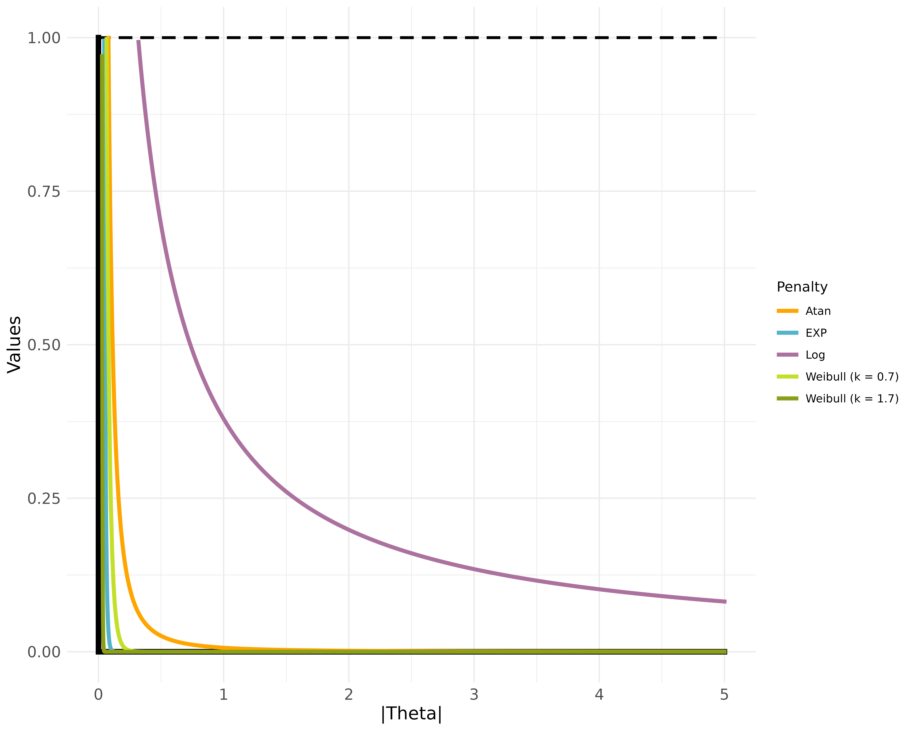
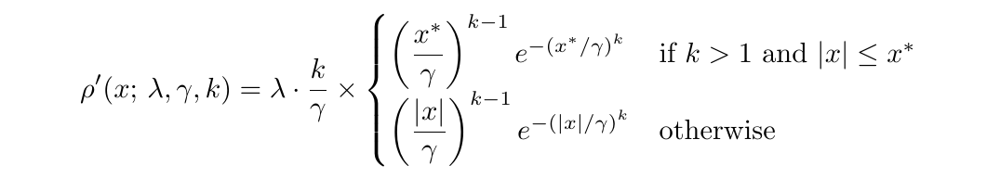

<table style="border: none; border-collapse: collapse;">
<tr style="border: none;">
<td style="border: none; vertical-align: middle; padding-right: 24px;">

</td>
<td style="border: none; vertical-align: middle;">

# L0ggm
#### Smooth $L_0$ Penalty Approximations for Gaussian Graphical Models

<a href="https://CRAN.R-project.org/package=L0ggm"></a> <a href="https://github.com/AlexChristensen/L0ggm/releases"></a> <a href="https://cranlogs.r-pkg.org/badges/grand-total/L0ggm"></a>

<a href="https://www.repostatus.org/#active"></a> <a href="https://github.com/AlexChristensen/L0ggm/actions/workflows/r.yml"></a>

</td>
</tr>
</table>

---

## Overview

This package estimates **Gaussian graphical models** (GGMs) using regularization penalties that approximate the $L_0$ norm. In a GGM, the nonzero off-diagonal entries of the precision matrix (inverse covariance) encode conditional dependence relationships between variables — the network structure. Recovering this sparse structure from data is the central estimation challenge.

The package implements five continuous, differentiable approximations to the $L_0$ norm as regularization penalties, applied through a Local Linear Approximation (LLA) framework that wraps the graphical LASSO solver. The **adaptive Weibull** penalty is the default, and is the primary methodological contribution of the package.

The package also provides simulation tools for generating GGM data with realistic psychometric network structure. Two topology generators are included: `simulate_smallworld()` produces small-world networks via degree-weighted Watts-Strogatz rewiring, and `simulate_sbm()` produces community-structured networks via a stochastic block model. Both are calibrated to edge weight distributions empirically observed across 194 psychometric networks (Huth et al., 2025) through `weibull_parameters()`, a Seemingly Unrelated Regression model that predicts Weibull shape and scale from network size, sample size, and signal-to-noise ratio.

---

## Installation

```r
# Ensure {remotes} is installed
if(!"remotes" %in% row.names(installed.packages())){
  install.packages("remotes")
}

# Install from GitHub
remotes::install_github("AlexChristensen/L0ggm")
```

---

## Usage

```r
# Load package
library(L0ggm)

# Simulate smallworld data
basic_smallworld <- simulate_smallworld(
  nodes = 20, # 20 nodes in the network
  density = 0.30, # moderate initial lattice connectivity
  rewire = 0.20, # 20% rewiring probability
  sample_size = 1000 # number of cases = 1000
)

# Estimate network with default adaptive Weibull penalty
# with full LLA (iterate to convergence; recommended)
weibull_network <- network_estimation(data = basic_smallworld$data, LLA = TRUE)

# Get full output (network, precision matrix, selected lambda, etc.)
weibull_full <- network_estimation(data = basic_smallworld$data, network_only = FALSE)

# Use the Arctangent penalty
atan_network <- network_estimation(
  data = basic_smallworld$data, penalty = "atan", LLA = TRUE
)

# Use the EXP penalty with fixed (non-adaptive) gamma
exp_network <- network_estimation(
  data = basic_smallworld$data, penalty = "exp", LLA = TRUE, adaptive = FALSE
)
```

---

## $L_0$ Regularization

### Why $L_0$ Regularization?

#### The role of regularization in network estimation

Estimating a GGM requires finding a sparse precision matrix $\mathbf{K}$ that balances fit to the data against model complexity:

$$\underset{\mathbf{K} \succ 0}{\text{minimize}} \quad -\log \det \mathbf{K} + \text{tr}(\mathbf{S}\mathbf{K}) + \sum_{i \neq j} \rho(K_{ij})$$

where $\mathbf{S}$ is the empirical covariance matrix and $\rho(\cdot)$ is a penalty function. The choice of $\rho$ determines both the computational tractability of the problem and the statistical properties of the solution.

#### $L_1$ regularization (GLASSO)

The graphical LASSO (GLASSO; Friedman, Hastie, & Tibshirani, 2008) uses an $L_1$ penalty, $\rho(x) = \lambda |x|$, which makes the problem strictly convex and globally solvable via coordinate descent. These properties have made GLASSO the dominant approach in network estimation and it remains a valuable, well-understood tool.

However, $L_1$ regularization carries an inherent statistical cost. Because the $L_1$ penalty grows linearly and without bound, it must shrink every coefficient toward zero to impose sparsity. This creates a tension: the same $\lambda$ that zeros out small spurious edges also attenuates the magnitude of large true edges. As a result, GLASSO tends to produce **biased estimates** of nonzero partial correlations, and achieving consistent edge selection often requires a $\lambda$ large enough to meaningfully distort edge magnitudes. In settings where the true network is very sparse or where variables have heterogeneous effect sizes, this bias can be consequential.

#### $L_0$ regularization

The $L_0$ norm counts the number of nonzero elements, $\|x\|_0 = |\{i : x_i \neq 0\}|$, and the $L_0$ penalty applies a fixed cost $\lambda$ to each nonzero edge regardless of its magnitude:

$$\rho_0(x) = \lambda \cdot \mathbf{1}(x \neq 0)$$

Unlike $L_1$, the $L_0$ penalty imposes **no shrinkage on nonzero coefficients** — it distinguishes only between zero and nonzero. Under standard regularity conditions, $L_0$-penalized estimators satisfy the **oracle property** (Fan & Li, 2001): asymptotically, they identify the true edge set exactly and estimate nonzero edges as if the true support were known in advance. This means better sparsity recovery, less bias in edge magnitudes, and more reliable structure learning — particularly in high-dimensional settings where $p$ is large relative to $n$.

<details>
<summary><strong>From $L_0$ to Tractable Approximations</strong></summary>

Direct $L_0$ minimization requires searching over all $2^{p(p-1)/2}$ subsets of candidate edges. For even modest network sizes (e.g., $p = 20$ implies 190 candidate edges), this combinatorial search is computationally intractable.

{L0ggm} addresses this through **continuous smooth approximations** $\rho(x; \lambda, \gamma)$ that closely mimic the $L_0$ indicator and satisfy three key properties:

1. $\rho(0; \lambda, \gamma) = 0$ — zero penalty at zero
2. $\rho(x; \lambda, \gamma) \to \lambda$ as $|x| \to \infty$ — bounded, like $L_0$
3. $\rho(x; \lambda, \gamma) \to \lambda \cdot \mathbf{1}(x \neq 0)$ as $\gamma \to 0$ — converges to the $L_0$ step function

Because the approximations are differentiable, their derivatives can be used as adaptive, element-wise GLASSO penalty weights via the **Local Linear Approximation** (LLA; Fan & Li, 2001; Zou & Li, 2008). At iteration $t$, the penalty is linearized around the current estimate $\mathbf{K}^{(t)}$:

$$\rho(K_{ij}) \approx \rho(K_{ij}^{(t)}) + \rho'(K_{ij}^{(t)}) \cdot (K_{ij} - K_{ij}^{(t)})$$

which reduces each step to a re-weighted GLASSO problem. A single LLA pass (the default) is extremely fast and produces estimates with strong theoretical guarantees (Zou & Li, 2008). Full iterative LLA to convergence is also available via `LLA = TRUE`.

The five penalties available in {L0ggm} are:

| Penalty | Formula | $\gamma$ |
|---------|---------|----------|
| `"atan"` (Wang & Zhu, 2016) | $\lambda \left(\gamma + \dfrac{2}{\pi}\right) \arctan \left(\dfrac{\lvert x \rvert}{\gamma}\right)$ | 0.01 |
| `"exp"` (Wang, Fan, & Zhu, 2018) | $\lambda \left(1 - e^{-\lvert x \rvert / \gamma}\right)$ | 0.01 |
| `"gumbel"` | $\dfrac{\lambda}{1 - e^{-1}} \left(e^{-e^{-\lvert x \rvert / \gamma}} - e^{-1}\right)$ | 0.01 |
| `"log"` (Candes, Wakin, & Boyd, 2008) | $\lambda \dfrac{\log\left(1 + \lvert x \rvert / \gamma\right)}{\log\left(1 + 1/\gamma\right)}$ | 0.10 |
| `"weibull"` *(default)* | $\lambda \left(1 - e^{-\left(\lvert x \rvert / \gamma\right)^k}\right)$ when $k \leq 1$ | 0.01 |

<em><strong>Note.</strong> The Gumbel penalty subtracts</em> $e^{-1}$ <em>from the raw Gumbel CDF to shift the y-intercept to zero, then scales by</em> $\lambda / (1 - e^{-1})$ <em>so that the penalty ceiling is</em> $\lambda$<em>, consistent with the other approximations. The Weibull formula shown applies for</em> $k \leq 1$<em>; for</em> $k > 1$ <em>the penalty is piecewise — linear up to the mode</em> $x^*$ <em>and a continuity-shifted Weibull CDF above it — matching the piecewise derivative described below.</em>

<p align="center">

</p>

<em><strong>Figure 1.</strong></em> $L_0$ <em>norm approximation penalties as a function of coefficient magnitude. Solid line:</em> $L_0$ <em>norm (step function). Dashed lines:</em> $L_1$ <em>norm (LASSO) and each continuous approximation penalty implemented in</em> {L0ggm}<em>. Gumbel is roughly equivalent to EXP (not pictured) and Weibull k = 1 is exactly EXP.</em>

</details>

<details>
<summary><strong>The Weibull Penalty</strong></summary>

#### What makes it different

The Weibull penalty introduces a **shape parameter** $k > 0$ that continuously interpolates between qualitatively different penalty regimes:

- **$k = 1$**: reduces exactly to the EXP penalty
- **$k < 1$**: the penalty becomes less concave than exponential, with a wider rise near the origin and slower convergence to $\lambda$ — moving away from the $L_0$ step function (see Figure 1)
- **$k \sim 0.40$**: approximates the Atan penalty
- **$k > 1$**: the penalty becomes more concave than exponential, with a sharper threshold near the scale — moving closer to the $L_0$ step function

This variation in $k$ allows Weibull to control the **degree of sparsity bias**: smaller $k$ imposes more shrinkage on nonzero coefficients and less aggressively zeros small ones. Rather than fixing $k$ by hand, {L0ggm} estimates it from the data.

#### Adaptive parameter estimation

When `adaptive = TRUE` (the default), both the shape $k$ and scale $\gamma$ of the Weibull penalty are calibrated to the observed partial correlation distribution, making the penalty data-driven rather than fixed. The same adaptive principle applies to the EXP and Gumbel penalties.

**Step 1 — Fit Weibull to empirical partial correlations.** Let $\{|p_{ij}|\}$ denote the lower-triangular absolute partial correlations. Maximum likelihood estimates $\hat{k}$ and $\hat{\lambda}_W$ are obtained by solving:

$$\frac{\sum_i |p_i|^{\hat{k}} \log|p_i|}{\sum_i |p_i|^{\hat{k}}} - \frac{1}{\hat{k}} - \frac{1}{n}\sum_i \log|p_i| = 0$$

$$\hat{\lambda}_W = \left(\frac{1}{n}\sum_i |p_i|^{\hat{k}}\right)^{1/\hat{k}}$$

**Step 2 — Set adaptive scale.** The scale parameter $\gamma$ is set to the **10th percentile** of the fitted Weibull distribution:

$$\gamma = \hat{\lambda}_W \cdot \left(-\log(0.90)\right)^{1/\hat{k}}$$

This is simply the Weibull quantile function evaluated at $p = 0.10$: the value below which 10% of the fitted partial correlations fall, serving as a data-driven threshold between noise and signal.

The choice of the 10th percentile is grounded in a concrete calibration anchor. In practice, the Weibull MLE of absolute partial correlations tends to produce shape estimates near $\hat{k} \approx 1$ and scale estimates near $\hat{\lambda}_W \approx 0.10$. Substituting these values:

$$\gamma \approx 0.10 \cdot (-\log 0.90)^{1} \approx 0.10 \times 0.105 \approx 0.01$$

This matches $\gamma = 0.01$, the fixed default known to work well with the EXP penalty, providing a principled empirical justification for the 10th percentile rule: at typical signal levels, it recovers the well-validated fixed default, while adapting to the actual distribution of partial correlations in data where signal strength deviates from this average. The same 10th-percentile rule is applied to EXP (via its fitted exponential scale) and Gumbel (via its fitted Gumbel quantile function) when those penalties are used adaptively.

The derivative used in the LLA is defined piecewise to ensure the penalty weight is always non-increasing in $|x|$. When $k \leq 1$ the Weibull PDF is already monotonically decreasing, so the standard formula applies directly. When $k > 1$ the raw PDF has an interior mode at $x^* = \gamma \left(\tfrac{k-1}{k}\right)^{1/k}$; values below this mode would otherwise receive *less* weight than values above it, violating the oracle-property requirement. The derivative is therefore capped at its peak for $|x| \leq x^*$:

<p align="left">

</p>

where $x^{\ast} = \gamma \left(\dfrac{k-1}{k}\right)^{1/k}$ is the mode of the Weibull PDF. The resulting derivative is monotonically non-increasing for all $k > 0$: as $|x|$ grows past the peak, weights decay to zero — large true edges receive vanishingly small additional penalization, directly addressing the magnitude bias of $L_1$ methods.

#### Distributional foundations and extreme value theory

The EXP, Weibull, and Gumbel penalties are not arbitrary constructions — they form a mathematically unified family rooted in extreme value theory. The table below shows each penalty alongside its LLA derivative, which reveals the distributional structure underlying each:

| Distribution | Penalty (CDF) | Derivative (PDF) |
|:---|:---|:---|
| Exponential | $1 - e^{-\lvert x\rvert/\gamma}$ | $\dfrac{1}{\gamma} e^{-\lvert x\rvert/\gamma}$ |
| Weibull | $1 - e^{-(\lvert x\rvert/\gamma)^k}$ | $\dfrac{k}{\gamma} \left(\dfrac{\lvert x\rvert}{\gamma}\right)^{k-1} e^{-(\lvert x\rvert/\gamma)^k}$ |
| Weibull $\to$ Exponential | $k = 1$ | $k = 1$ |
| Gumbel $(\mu = 0)$ | $e^{-e^{-\lvert x\rvert/\gamma}}$ | $\dfrac{1}{\gamma} e^{-\lvert x\rvert/\gamma - e^{-\lvert x\rvert/\gamma}}$ |
| Gumbel $\to$ Weibull | $1 - Gumbel(x; \gamma) = Weibull\left(e^{-x}; k = \tfrac{1}{\gamma}, \gamma = 1\right)$ | $Gumbel(x; \gamma) = Weibull\left(e^{-x}; k = \tfrac{1}{\gamma}, \gamma = 1\right) \cdot e^{-x}$ |

**The Weibull as the general case.** The EXP penalty is the exact special case $k = 1$ of the Weibull — its derivative, its adaptive scale estimation, and its convergence behavior are all inherited from the Weibull family. The Weibull strictly generalizes EXP across the full range $k \in (0, \infty)$.

**The Gumbel–Weibull connection.** Less obviously, the Gumbel and Weibull are also deeply related. The table shows that the Gumbel survival function $1 - G(x; \gamma)$ equals the Weibull CDF evaluated at the log-transformed argument $e^{-x}$, with shape $k = 1/\gamma$. Equivalently, if $X$ follows a Weibull distribution, then $-\log X$ follows a Gumbel distribution. This log-linear relationship is the classical link between the Type I and Type III extreme value families, and it means the Gumbel penalty is a reparametrized Weibull penalty under a change of variable — a further instance of Weibull's generality.

**Generalized extreme value (GEV) distribution.** The reason these distributions co-occur is the **Fisher–Tippett–Gnedenko theorem** (Fisher & Tippett, 1928; Gnedenko, 1943): the normalized maximum of $n$ i.i.d. random variables converges in distribution, as $n \to \infty$, to the generalized extreme value (GEV) family:

$$G(x; \mu, \sigma, \xi) = \exp\left\lbrace -\left[1 + \xi\left(\frac{x - \mu}{\sigma}\right)\right]^{-1/\xi}\right\rbrace$$

The tail index $\xi$ selects among three qualitatively distinct limiting types:

- **$\xi = 0$ (Gumbel, Type I)**: the limit of exponential-class tails; $G(x) = \exp\left(-e^{-(x-\mu)/\sigma}\right)$
- **$\xi > 0$ (Fréchet, Type II)**: heavy-tailed, unbounded support
- **$\xi < 0$ (Weibull, Type III)**: bounded support, arising from distributions with a finite right endpoint

Only Type I (Gumbel) and Type III (Weibull) are used as penalties in {L0ggm}. This is not coincidental: **these are precisely the two GEV types whose CDFs are bounded above and approach 1 as $x \to \infty$**. The Fréchet CDF grows without bound, violating the fundamental $L_0$ approximation requirement that $\rho(x) \to \lambda$ as $|x| \to \infty$, and is therefore unsuitable as a penalty.

**Why extreme value CDFs are ideal $L_0$ approximations.** The $L_0$ penalty is a Heaviside step function: zero below a threshold, constant above. Extreme value CDFs share exactly this structural character — they are bounded, concave, and rise from 0 to a finite ceiling — because they represent the limiting distribution of extreme order statistics under the most general conditions. This is no coincidence from the perspective of sparsity: recovering sparse structure amounts to discriminating between the very smallest coefficients (noise) and all others (signal), which is precisely the problem that extreme value distributions are designed to describe.

The Weibull CDF in particular describes the distribution of the **minimum** of a large sample from distributions with polynomial density near zero. Because partial correlations are bounded in $[0, 1]$, the relevant domain of the penalty lies in the range $[0, \hat{\lambda}_W]$ where $\hat{\lambda}_W < 1$. In this regime, the shape parameter $k$ controls the sharpness of the threshold at the scale $\gamma$: for $x < \gamma$, raising to a larger power $k$ shrinks $(x/\gamma)^k$ toward zero (since $x/\gamma < 1$), while for $x > \gamma$, the same large $k$ amplifies $(x/\gamma)^k$ toward infinity. As $k \to \infty$, the Weibull CDF converges pointwise to $\lambda \cdot \mathbf{1}(x > \gamma)$ — a step function at the scale — the $L_0$ indicator itself.

The same structure governs the LLA derivative. For $k > 1$, the piecewise derivative holds a constant plateau near the origin (up to the mode $x^*$) and then decays — producing a consistent penalty on all near-zero coefficients and vanishing penalization on large ones. This is the continuous analog of $L_0$ hard thresholding: aggressively zero small edges, leave large edges essentially unpenalized. For $k < 1$, the derivative decays from a very large value at the origin, imposing the largest penalty weights on the smallest coefficients — an increasingly proportional, $L_1$-like profile. The adaptive fitting procedure estimates $k$ from the data without restriction; in dense or moderate-signal settings it will select $k > 1$, driving the penalty toward the $L_0$ limit, while sparse settings with many near-zero partial correlations tend to produce $k < 1$.

</details>

---

## Simulation

{L0ggm} provides two functions for generating GGM data with realistic psychometric network structure. Both are calibrated to edge weight distributions observed across 194 empirical psychometric networks (Huth et al., 2025) via `weibull_parameters()`, with shared support for skewed data generation, positive-definiteness conditioning, and reproducible rejection diagnostics.

<details>
<summary><strong><code>simulate_smallworld()</code> — Small-world network structure</strong></summary>

Generates GGM data from a small-world topology via a three-stage process closely aligned with empirical psychometric network properties.

**Stage 1 — Ring lattice.** A ring lattice is constructed with `neighbors + 1` nearest-neighbor connections per node, where `neighbors` is derived from `nodes` and `density`. The extra neighbor ensures the lattice always has more edges than the target, guaranteeing pruning can proceed.

**Stage 2 — Pruning.** The lattice is randomly pruned to the target `density` by removing edges uniformly at random while maintaining graph connectivity. This creates degree heterogeneity before any rewiring, providing a non-uniform prior for the next stage.

**Stage 3 — Degree-weighted rewiring.** Each edge is independently rewired with probability `rewire`. Unlike standard Watts-Strogatz, the new endpoint is selected proportionally to $\sqrt{d_i + d_k}$ (combined degree of the candidate pair), moderating the extreme hubs of linear preferential attachment while still producing realistic degree heterogeneity.

**Edge weights.** Retained lattice edges receive weights by neighbor-distance priority (nearer = stronger); rewired edges receive lowest priority. Absolute weights are drawn from a Weibull distribution via `weibull_parameters()`.

| Argument | Description |
|---|---|
| `nodes` | Number of nodes (8–54 recommended) |
| `density` | Target edge density after pruning |
| `rewire` | Rewiring probability (small-world regime: ~0.01–0.30) |
| `snr` | Signal-to-noise ratio $\bar{\lvert w \rvert} / \mathrm{SD}(\lvert w \rvert)$; default `1` |
| `negative_proportion` | Fraction of edges signed negative; default drawn from empirical distribution |
| `sample_size` | Number of observations to generate |
| `skew` / `skew_range` | Per-variable skew in $[-2, 2]$; default `0` |

**Returns:** a named list with `data`, `parameters` (including `omega` smallworldness), `population` (`R`, `Omega`), and `convergence`.

```r
result <- simulate_smallworld(
  nodes = 20, density = 0.30, rewire = 0.20, sample_size = 500
)
```

</details>

<details>
<summary><strong><code>simulate_sbm()</code> — Stochastic block model structure</strong></summary>

Generates GGM data with explicit community (block) structure, where edge density is controlled separately within and between communities via a `blocks × blocks` density matrix.

**Structure.** Nodes are partitioned into `blocks` communities of size `nodes` (scalar or per-block vector). For each pair of communities $(i, j)$, edges are included independently with probability `density_matrix[i, j]`. The resulting graph is required to be connected; disconnected draws are rejected and resampled.

**Edge weights and diffusion.** Absolute weights are drawn from a Weibull distribution via `weibull_parameters()`. The `diffusion` parameter controls the minimum fraction of high-weight edges reserved for within-community positions: `1 - diffusion` of within-community slots are filled from the top-ranked weight draws, with the remaining slots drawn randomly. Because random draws can also land within communities by chance, the actual within-community weight advantage typically exceeds `1 - diffusion`. Newman-Girvan modularity $Q$ (returned in `parameters`) summarizes the community contrast actually achieved.

**Between-community sign.** Each between-community edge is independently signed negative with probability `negative_proportion`, modeling inhibitory connections. Within-community edges are always positive.

| Argument | Description |
|---|---|
| `nodes` | Nodes per block (scalar or length-`blocks` vector; min 3 per block) |
| `blocks` | Number of community blocks |
| `density_matrix` | `blocks × blocks` symmetric matrix of edge probabilities |
| `snr` | Signal-to-noise ratio; default `1` |
| `negative_proportion` | Fraction of between-community edges signed negative; default from empirical distribution |
| `diffusion` | Minimum proportion of top edges placed outside communities; default `0.30` |
| `diffusion_range` | If provided, `diffusion` is drawn uniformly from this interval each call |
| `sample_size` | Number of observations to generate |
| `skew` / `skew_range` | Per-variable skew in $[-2, 2]$; default `0` |

**Returns:** a named list with `data`, `parameters` (including `Q` modularity and `weibull` edge weight parameters), `population` (`R`, `Omega`, `membership`), and `convergence`.

```r
dm <- matrix(0.20, nrow = 3, ncol = 3)
diag(dm) <- 0.90

result <- simulate_sbm(
  nodes = 6, blocks = 3, density_matrix = dm, sample_size = 500
)
```

</details>

<details>
<summary><strong><code>weibull_parameters()</code> — Empirically calibrated edge weight distribution</strong></summary>

Predicts the Weibull shape $k$ and scale $\lambda_W$ that characterize absolute partial correlation edge weights for a network of given size and sample size. Predictions come from a Seemingly Unrelated Regression (SUR) model fitted to 194 empirical psychometric networks (Huth et al., 2025), where absolute partial correlations were found to follow a Weibull distribution more consistently than Beta, Gamma, or log-normal alternatives.

**Predictors.** The two SUR equations have an asymmetric structure:

- **Shape** is predicted from `snr` and `rlp` $= 1/\log(p)$, capturing the diminishing marginal effect of network size on weight concentration. Shape governs the spread of the edge weight distribution and is not affected by sampling precision.
- **Scale** is predicted from `snr`, `rlp`, and `scaling` $= \sqrt{1/(n - p - 2)}$ (the standard error of partial correlations). Scale governs the typical magnitude of edge weights and is directly affected by estimation precision.

**Model fit.** Shape: $R^2 = 0.887$, RMSE $= 0.048$. Scale: $R^2 = 0.885$, RMSE $= 0.011$. Residual correlation between equations: $0.261$ (motivating SUR). Empirical ranges: shape $\in [0.72, 1.63]$ (M $= 1.07$, SD $= 0.14$); scale $\in [0.03, 0.19]$ (M $= 0.10$, SD $= 0.03$).

| Argument | Description |
|---|---|
| `nodes` | Number of nodes (8–54 to stay within empirical training range) |
| `sample_size` | Sample size of the dataset |
| `snr` | Signal-to-noise ratio $\bar{\lvert w \rvert} / \mathrm{SD}(\lvert w \rvert)$; default `1` |
| `bootstrap` | If `TRUE`, adds a sampled SUR residual — use in simulation for replication-to-replication variability |

```r
# Predicted parameters for a 15-node network, n = 300
weibull_parameters(nodes = 15, sample_size = 300)

# With bootstrapped residuals for Monte Carlo simulation
weibull_parameters(nodes = 15, sample_size = 300, bootstrap = TRUE)
```

</details>

<details>
<summary><strong>Simulation internals (<code>helpers_simulation</code>)</strong></summary>

The shared simulation pipeline is implemented in `helpers_simulation.R` and handles tasks common to both `simulate_smallworld()` and `simulate_sbm()`.

**`generate_edges()`** draws absolute edge weights from a Weibull distribution parameterized by `weibull_parameters()`. Draws are repeated until no weight exceeds the empirical maximum ($\approx 0.845$), and are then sampled proportionally to $w^2$ (preferring larger weights for occupied edges). The Weibull parameters are restricted to empirical bounds (shape $\in [0.70, 1.70]$, scale $\in [0.03, 0.19]$); draws outside these bounds are discarded.

**`condition_network()`** recovers positive definiteness by adding a minimal ridge penalty $\lambda$ to the diagonal of the precision matrix via `uniroot()`, targeting a user-specified condition number. Maximum shrinkage is capped at approximately 23% following Peeters et al. (2020).

**`simulate_data()`** generates multivariate normal observations via a Cholesky decomposition of the population correlation matrix $\mathbf{R}$, then applies variable-level skew transformations. Skew values are rounded to the nearest 0.05 increment within $[-2, 2]$; if `skew_range` is provided, per-variable skew is drawn uniformly from the interval.

</details>

---

## References

Candes, E. J., Wakin, M. B., & Boyd, S. P. (2008). Enhancing sparsity by reweighted l1 minimization. *Journal of Fourier Analysis and Applications*, *14*(5), 877&ndash;905. https://doi.org/10.1007/s00041-008-9045-x

Fisher, R. A., & Tippett, L. H. C. (1928). Limiting forms of the frequency distribution of the largest or smallest member of a sample. *Mathematical Proceedings of the Cambridge Philosophical Society*, *24*(2), 180&ndash;190. https://doi.org/10.1017/S0305004100015681

Gnedenko, B. (1943). Sur la distribution limite du terme maximum d'une série aléatoire. *Annals of Mathematics*, *44*(3), 423&ndash;453. https://doi.org/10.2307/1968974

Dicker, L., Huang, B., & Lin, X. (2013). Variable selection and estimation with the seamless-L0 penalty. *Statistica Sinica*, *23*(2), 929&ndash;962. https://doi.org/10.5705/ss.2011.074

Fan, J., & Li, R. (2001). Variable selection via nonconcave penalized likelihood and its oracle properties. *Journal of the American Statistical Association*, *96*(456), 1348&ndash;1360. https://doi.org/10.1198/016214501753382273

Friedman, J., Hastie, T., & Tibshirani, R. (2008). Sparse inverse covariance estimation with the graphical lasso. *Biostatistics*, *9*(3), 432&ndash;441. https://doi.org/10.1093/biostatistics/kxm045

Huth, K. B. S., Haslbeck, J. M. B., Keetelaar, S., Van Holst, R. J., & Marsman, M. (2025). Statistical evidence in psychological networks. *Nature Human Behaviour*.

Peeters, C. F., van de Wiel, M. A., & van Wieringen, W. N. (2020). The spectral condition number plot for regularization parameter evaluation. *Computational Statistics*, *35*(2), 629&ndash;646. https://doi.org/10.1007/s00180-019-00912-z

Wang, Y., Fan, Q., & Zhu, L. (2018). Variable selection and estimation using a continuous approximation to the $L_0$ penalty. *Annals of the Institute of Statistical Mathematics*, *70*(1), 191&ndash;214. https://doi.org/10.1007/s10463-016-0588-3

Wang, Y., & Zhu, L. (2016). Variable selection and parameter estimation with the Atan regularization method. *Journal of Probability and Statistics*, *2016*, 1&ndash;12. https://doi.org/10.1155/2016/6495417

Williams, D. R. (2020). Beyond lasso: A survey of nonconvex regularization in Gaussian graphical models. *PsyArXiv*. https://doi.org/10.31234/osf.io/ad57p

Zou, H., & Li, R. (2008). One-step sparse estimates in nonconcave penalized likelihood models. *Annals of Statistics*, *36*(4), 1509&ndash;1533. https://doi.org/10.1198/016214506000000735
